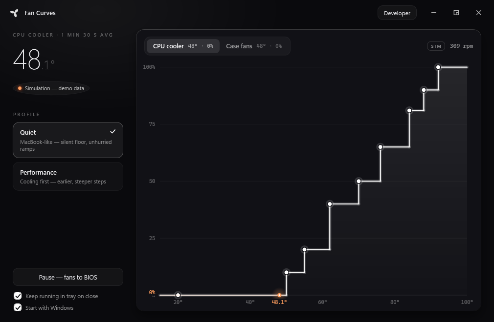
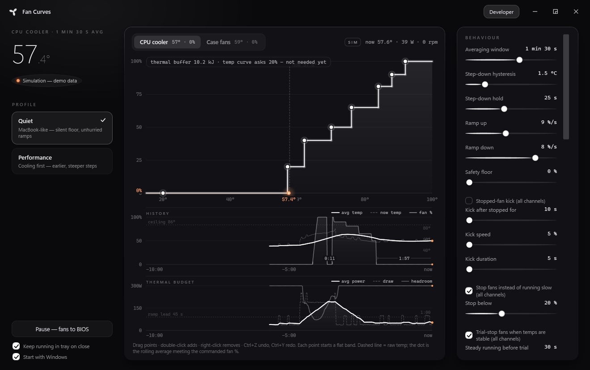

# FanCurves

MacBook-like fan control for Windows desktops. Fans sit **fully stopped at idle**,
ignore short temperature spikes entirely, and ramp up smoothly only under
*sustained* load — the way Apple laptops manage their fans, applied to your
motherboard's fan headers.



## Why

Motherboard "smart fan" curves react to the *instantaneous* CPU temperature. On a
modern CPU that value jumps 15–20 °C for half a second every time a browser tab
opens, so the fans audibly surge and settle all day — the classic desktop
"whoosh… whoosh…" that a MacBook never does. A MacBook drives its fans from a
slow-moving average and simply doesn't care about spikes.

FanCurves does the same for a desktop:

- **The curve is driven by a rolling average** (up to 5 minutes; the default
  Quiet preset uses 90 s for the CPU). A brief compile or a game loading screen
  barely moves it; fan speed only follows heat that *stays*.
- **Staircase curves, not slopes.** Each curve point opens a flat band — the fan
  holds one speed across a whole temperature range instead of constantly
  micro-adjusting.
- **Stepping down is deliberate**: the average must fall below the band by a
  hysteresis margin *and stay there* for a hold period before the fan slows.
  No flapping at band edges.
- **Slew-rate limiting** (default 8 %/s) makes every change a gradual, barely
  audible glide instead of a jump.
- **Stopped means stopped**: a 0 % floor at idle, plus *zero snap* — any target
  below a threshold (default 20 %) runs the fan at 0 % instead of a slow crawl.
  Meaningful speed or silence, never a faint whirr.
- **Stop probe**: a fan that has been running steadily with stable temperatures
  gets trial-stopped; if the temperature holds, it stays off. If the trial fails,
  a backoff prevents on/off cycling.
- **Stopped-fan kick** (optional, off by default): periodically spins stopped
  fans for a few seconds to keep bearings moving.

## Thermal-budget control (power, not temperature)

On channels with a power sensor (CPU package power is auto-assigned), FanCurves
goes one step further than averaging temperature — it controls from **power
draw** and treats the heatsink's thermal mass as a spendable credit:

- **Power averaged over a minute** is the true measure of how much heat the
  cooler must ultimately move; temperature is just where that heat happens to
  be right now.
- The app **learns your cooler's thermal mass** C (J/°C), its cooling
  resistance at each fan speed, and its idle baseline — continuously, from
  normal use, persisted in the profile. Knowing C it knows the energy credit
  left before the die gets hot: `E = C · (T_ceiling − T_now)`.
- **A short burst (a 30 s compile) never moves the fan** — its joules soak into
  heatsink metal, and the credit comfortably covers them.
- The fan **ramps only when the prediction says the buffer is running low**
  (default: under 45 s of headroom left), and it steps straight to the curve
  level whose equilibrium temperature sits back under the ceiling.
- After the load ends the power average collapses within a minute, so fans
  **step back down minutes earlier** than any temperature average would allow.
- **Fuse — silence never at the price of throttling**: a parallel hard override
  watches the raw die temperature every tick. At the override threshold
  (default 90 °C) the channel's own temperature curve takes over *instantly*,
  with no slew limiting, and keeps the floor until the die cools off. A wrong
  or still-learning model can cost you some silence, never your CPU.

The temperature staircase you edit stays meaningful: it supplies the ladder of
allowed fan speeds and the fallback curve for the override. Power control can
be turned off per app (Developer mode), and channels without a power sensor
simply keep the temperature behaviour above.

## Download & run

Grab the latest zip from [Releases](../../releases), unzip anywhere, run
`FanCurves.exe`. No installer, no .NET required (self-contained build).

- **Administrator required** — fan control needs kernel-level Super I/O access,
  so the app always asks for elevation.
- **Windows 11 with Memory Integrity (HVCI) on** — the default driver is blocked;
  install [PawnIO](https://pawnio.eu) (signed, HVCI-compatible) and FanCurves
  uses it automatically. Symptom without it: CPU temp reads 0 and no fan headers
  appear.

First launch auto-detects temperature sensors and motherboard fan headers,
applies the default **Quiet (MacBook-like)** preset immediately, and keeps
running in the tray when you close the window (the tray tooltip shows live
temps → fan %). A Task Scheduler entry starts it with Windows (toggleable
in-app). **Pause** in the app — or quitting — hands every fan header back to
the BIOS.

### Modes

- **Simple** (default): pick a preset — `Quiet · MacBook-like` or
  `Performance` — see the live curve and the rolling average that drives it.
  Nothing to configure.
- **Developer** (top-bar toggle or `--dev`): edit curve points by dragging
  (double-click to add, right-click to remove, Ctrl+Z/Y undo/redo), tune the
  averaging window / hysteresis / hold / slew per channel, configure
  thermal-budget control down to its internals (power averaging, ramp lead,
  override temperature, buffer ceiling, sustained aim, trend / warming-rate /
  live-draw windows, fuse release — with live readouts of draw, buffer,
  predicted headroom and the learned cooler model, which you can freeze or
  reset), assign temperature /
  power sensors and headers manually, and watch two 10-minute strips: thermal
  history (average temp, raw temp, commanded fan %, the budget ceiling, and a
  marker for every fan stop/start) and the thermal budget itself — power draw
  and its sustained average against the predicted headroom and the ramp-lead
  threshold that triggers a step up, with any fuse periods shaded.



A notification chip on the chart explains *why* the current fan speed differs
from the configured curve level (ramping, step-down hold with countdown,
hysteresis, zero snap, stop probe…) whenever it does.

## Hardware support

Sensors and fan headers come from
[LibreHardwareMonitor](https://github.com/LibreHardwareMonitor/LibreHardwareMonitor),
so any Super I/O chip it can drive works (Nuvoton, ITE, Fintek — most consumer
boards). Notes:

- **GPU fans are deliberately excluded** — this app drives motherboard headers
  only. GPU temperatures are still available as inputs for case-fan curves.
- **Pump headers are never auto-assigned** (you can still assign them manually
  in Developer mode, at your own risk).
- Channels keep a configurable minimum-% safety floor; the `Performance` preset
  keeps the CPU fan at ≥30 % at all times.

Config lives in `%AppData%\FanCurves\profile.json` (auto-saved). Diagnostics:
`sensors.txt` (everything detected at launch) and `events.txt` (lifecycle log)
in the same folder.

## Build from source

Requires the .NET 8 SDK.

```
dotnet build
dotnet run --project src/FanCurves          # real hardware if elevated, else simulation
dotnet run --project src/FanCurves -- --sim # force the simulated backend (no admin needed)
```

The simulated backend fakes a modern CPU with idle spikes and load phases —
the full UI and filtering pipeline work without touching hardware, which is
also how the screenshots above were taken
(`--sim --screenshot out.png` renders for 4 s and exits).

Layout: `src/FanCurves.Core` is the engine (curves, response filter, engine
tick, hardware backends — no UI dependencies); `src/FanCurves` is the WPF app.

## License

MIT
